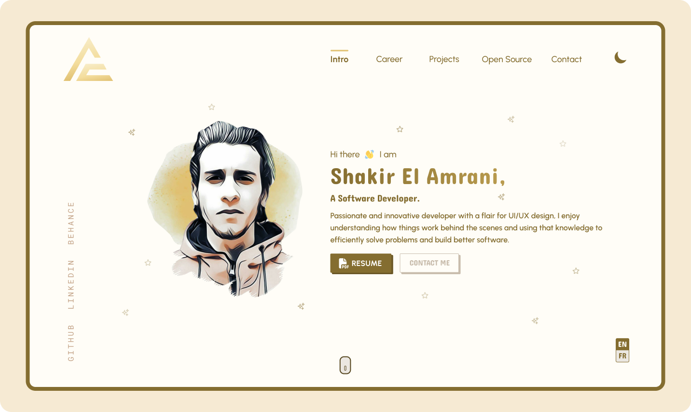

<div align="center">
  
  
  # amranich.dev
  
  **My portfolio website is designed to showcase both my personality and skills as a software developer.**

  
  [](https://github.com/AmraniCh/amranich.dev/actions/workflows/deploy.yml)
  [](https://github.com/AmraniCh/amranich.dev/releases)
  [](LICENSE)

  [Visit Website](https://amranich.dev) • [View Changelog](CHANGELOG.md) • [Report Bug](https://github.com/AmraniCh/amranich.dev/issues)
</div>

---

## 🔗 Links

- **Live Website**: [amranich.dev](https://amranich.dev)
- **Design on Behance**: [View Design](https://www.behance.net/gallery/238174557/Personal-Portfolio-Website-V1-amranichdev)

## ⚡ Features

- Fully responsive design for all screen sizes
- Support Non-JavaScript Clients
- Multilingual support (currently English and French)  
- Secure contact form with PHPMailer and Google reCAPTCHA  
- Custom 404/500 error pages  
- SEO optimized metadata and Open Graph support
- Automated CI/CD deployment using GitHub Actions  
- Hosted on AWS Lightsail, used Nginx as a web server, vsftpd as an FTP server

## 🛠️ Tech Stack

**Frontend**
- [Tailwind CSS](https://tailwindcss.com/) - Utility-first CSS framework
- Vanilla JavaScript

**Backend**
- [Jigsaw](https://jigsaw.tighten.co/) - Static site generator
- [PHPMailer](https://github.com/PHPMailer/PHPMailer) - Email sending via SMTP

**Deployment**
- AWS EC2 (Debian) - Hosting
- nginx - Web server
- vsftpd - FTP server with SSL/TLS support
- GitHub Actions - CI/CD pipeline

## 🚀 Quick Start

### Prerequisites
- PHP 8.0+
- Composer
- Node.js 14+
- npm

### Installation

```bash
# clone the repository
git clone https://github.com/AmraniCh/amranich.dev.git
cd amranich.dev

# install PHP dependencies
composer install

# install Node packages
npm install
```

### Development

```bash
# development server with hot reload
npm run watch

# development build
npm run dev

# production build
npm run prod
```

The site will be built in the `build_production` directory.

## 🔧 Configuration

### Environment Variables

Create `.env` from `env.example`:

```bash
# Copy environment file
cp source/backend/env.example source/backend/.env
```

Update with your credentials:

```env
SMTP_FROM_ADDRESS=
SMTP_TO_ADDRESS=
SMTP_HOST=
SMTP_PORT=
SMTP_USERNAME=
SMTP_PASSWORD=
RECAPTCHA_SECRET=
```

## 🚀 Deployment

The project uses GitHub Actions for automated deployment via FTPS:

1. Push code or create a tag
2. GitHub Actions builds the project
3. Files are deployed via FTPS

See [`.github/workflows/deploy.yml`](.github/workflows/deploy.yml) for details.

## 📝 License

This project’s **code** is released under the [MIT License](LICENSE).

If you’re interested in building a similar website or need assistance, feel free to reach out at **contact@amranich.dev**. I’ll be happy to help.

---

<div align="center">
  Made with 💛 by <a href="https://github.com/AmraniCh">AmraniCh</a>
</div>