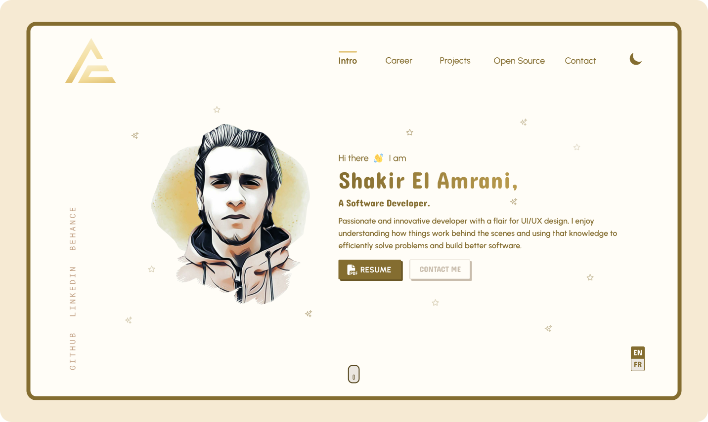

<div align="center">
  
  
  # amranich.dev

  My personal portfolio website, built to showcase my work and skills as a software developer.

  [](https://github.com/AmraniCh/amranich.dev/actions/workflows/deploy.yml)
  [](https://github.com/AmraniCh/amranich.dev/releases)
  [](LICENSE)

  [Visit Website](https://amranich.dev) | [Changelog](CHANGELOG.md) | [Report Bug](https://github.com/AmraniCh/amranich.dev/issues)

  [](https://amranich.dev)
  [](https://www.behance.net/gallery/238174557/Personal-Portfolio-Website-V1-amranichdev)
  [](https://cssnectar.com/css-gallery-inspiration/shakir-el-amrani-portfolio)
</div>

## Features

- Fully responsive design
- Support for non-JavaScript clients
- Multilingual support (English and French)
- Contact form with PHPMailer and Google reCAPTCHA
- Custom 404/500 error pages
- SEO optimized metadata and Open Graph support
- Automated CI/CD deployment using GitHub Actions
- Hosted on AWS Lightsail with Nginx and vsftpd (FTPS)

## Tech Stack

**Frontend**
- [Tailwind CSS](https://tailwindcss.com/)
- Vanilla JavaScript

**Backend**
- [Jigsaw](https://jigsaw.tighten.co/) - PHP static site generator
- [PHPMailer](https://github.com/PHPMailer/PHPMailer) - Email sending via SMTP

**Deployment**
- AWS Lightsail (Debian)
- Nginx
- vsftpd with SSL/TLS
- GitHub Actions

## Setup

### Prerequisites
- PHP 8.0+
- Composer
- Node.js 14+
- npm

### Installation

```bash
git clone https://github.com/AmraniCh/amranich.dev.git
cd amranich.dev

composer install
npm install
```

### Development

```bash
npm run watch    # dev server with hot reload
npm run dev      # development build
npm run prod     # production build
```

Build output goes to `build_production/`.

### Environment Variables

Copy `source/backend/env.example` to `source/backend/.env`:

```bash
cp source/backend/env.example source/backend/.env
```

Update with your credentials:

```env
SMTP_FROM_ADDRESS=
SMTP_TO_ADDRESS=
SMTP_HOST=
SMTP_PORT=
SMTP_USERNAME=
SMTP_PASSWORD=
RECAPTCHA_SECRET=
```

## Deployment

Push to the repo or create a tag, GitHub Actions builds and deploys via FTPS. See [`.github/workflows/deploy.yml`](.github/workflows/deploy.yml).

## License

This project's code is released under the [MIT License](LICENSE).

If you're interested in building a similar website or need help, feel free to reach out at **contact@amranich.dev**.
